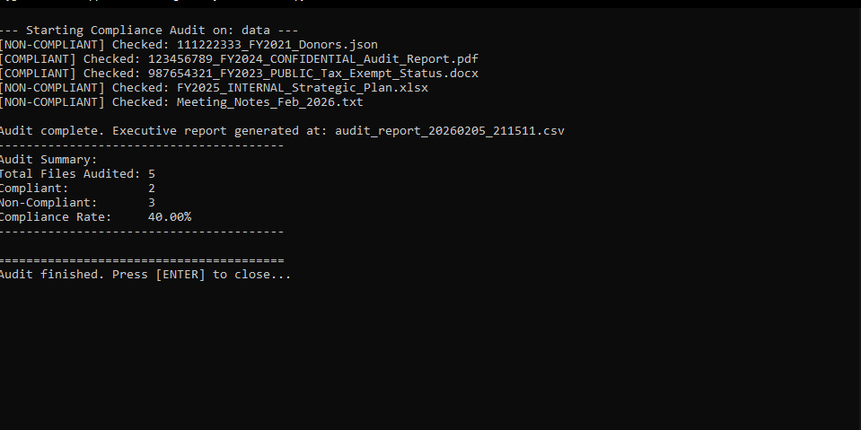

# Federal Compliance Audit Tool

## Project Overview
An automated verification engine built to validate organizational digital assets against federal non-profit filing standards. This tool was developed to streamline administrative workflows for Laty's Foundation by bridging technical automation with regulatory oversight.



## Core Features
* Regex-Based Filename Auditing: Automated scanning for mandatory compliance strings including Tax IDs and Fiscal Years.
* CSV Reporting: Generates detailed audit trails for executive review using Pandas.
* Configurable Rule Engine: JSON-based system allows for updating compliance standards without modifying core application logic.

## Learning Narrative
Drawing from my experience as President of Laty's Foundation, I identified a significant friction point in maintaining federal filing readiness. This tool demonstrates the application of IT Programming principles—specifically data processing with Pandas and pattern matching with Regex—to solve real-world business challenges and provide measurable value to non-profit administration.

## Technical Stack
* Language: Python 3.x
* Data Analysis: Pandas
* Configuration: JSON
* Version Control: Git
* Logic: Regular Expressions (Regex)

## Industry Competencies
* Python Scripting and Automation
* Systems Analysis and Requirements Gathering
* Regulatory Compliance Oversight
* Business Process Optimization

## Setup and Usage
1. Dependency Installation:
   ```bash
   pip install pandas
   ```
2. Configuration:
   Define compliance patterns in rules.json.
3. Execution:
   Place files in the data directory and run the audit.
   ```bash
   python audit_tool.py
   ```
4. Reporting:
   Review the timestamped CSV file for detailed compliance status and missing mandatory identifiers.
